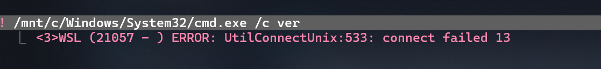
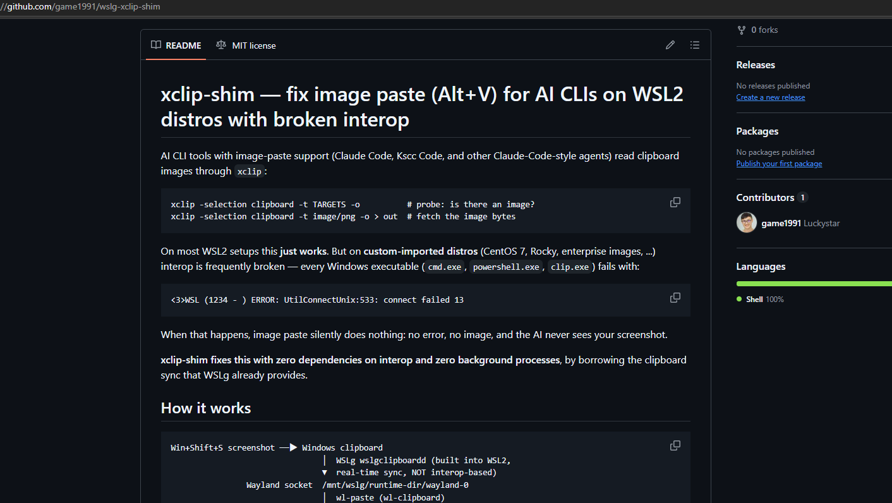

# xclip-shim — fix image paste (Alt+V) for AI CLIs on WSL2 distros with broken interop

[](LICENSE)
[](xclip)
[](https://github.com/microsoft/wslg)
[](https://github.com/game1991/wslg-xclip-shim/actions/workflows/shellcheck.yml)

AI CLI tools with image-paste support (Claude Code, Kscc Code, and other
Claude-Code-style agents) read clipboard images through `xclip`:

```
xclip -selection clipboard -t TARGETS -o          # probe: is there an image?
xclip -selection clipboard -t image/png -o > out  # fetch the image bytes
```

On most WSL2 setups this **just works**. But on **custom-imported distros**
(CentOS 7, Rocky, enterprise images, ...) interop is frequently broken — every
Windows executable (`cmd.exe`, `powershell.exe`, `clip.exe`) fails with:

```
<3>WSL (1234 - ) ERROR: UtilConnectUnix:533: connect failed 13
```

When that happens, image paste silently does nothing: no error, no image, and
the AI never sees your screenshot.

**xclip-shim fixes this with zero dependencies on interop and zero background
processes**, by borrowing the clipboard sync that WSLg already provides.

## Demo

**Before** — interop broken, every Windows executable fails, paste silently does nothing:



**After** — screenshot → Alt+V → the image lands in the AI CLI prompt:



## How it works

```
Win+Shift+S screenshot ──▶ Windows clipboard
                                │  WSLg wslgclipboardd (built into WSL2,
                                ▼  real-time sync, NOT interop-based)
                Wayland socket  /mnt/wslg/runtime-dir/wayland-0
                                │  wl-paste (wl-clipboard)
                                ▼
                /usr/local/bin/xclip   ← this shim (BMP → PNG on the fly)
                                ▼
                AI CLI image paste (Alt+V) ✅
```

Key facts this relies on:

1. **WSLg clipboard sync is independent of interop.** Even when no Windows
   executable can be launched from WSL, the Wayland socket
   `/mnt/wslg/runtime-dir/wayland-0` keeps mirroring the Windows clipboard in
   real time. (`wsl --version` showing a WSLg version = you have it.)
2. **Windows puts screenshots on the clipboard as `image/bmp`**, not PNG. The
   shim converts BMP → PNG live via ImageMagick.
3. The shim installs at `/usr/local/bin/xclip`, which shadows `/usr/bin/xclip`
   through normal `PATH` order. Text-clipboard requests fall through to the
   real `xclip`, so nothing else changes behavior.

## Install

```bash
git clone https://github.com/game1991/wslg-xclip-shim.git
cd wslg-xclip-shim
sudo ./install.sh
```

The installer checks your environment (WSL2 + WSLg socket), installs missing
`wl-clipboard` / `imagemagick` packages, backs up any existing shim, and runs a
self-test. Then: **take a screenshot (`Win+Shift+S`) and press Alt+V in your AI
CLI** — the image should appear in the prompt.

## Uninstall

```bash
./uninstall.sh   # removes the shim, restores the original xclip
```

## Troubleshooting

| Symptom | Check | Fix |
|---|---|---|
| `UtilConnectUnix:533: connect failed 13` when running `cmd.exe` | `cat /etc/wsl.conf` `[interop] enabled` | set `enabled = true`, then `wsl --shutdown`. If it still fails, your distro's PID 1 is not Microsoft's `/init` (`ps -p 1 -o comm=`) — interop is broken at the image level; this shim is exactly the workaround for that |
| Alt+V shows "no image in clipboard" | `ls -S /mnt/wslg/runtime-dir/wayland-0` exists? | WSLg missing — upgrade WSL (`wsl --update`); shim cannot help without the Wayland socket |
| Probe works but paste yields nothing | `wl-paste --list-types` (with `WAYLAND_DISPLAY=/mnt/wslg/runtime-dir/wayland-0 XDG_RUNTIME_DIR=/mnt/wslg`) | if only `image/bmp` shows, the shim's BMP→PNG path handles it; make sure ImageMagick `convert` is installed |
| Text paste changed behavior | shim should pass text through to real xclip | check `$PATH` puts `/usr/local/bin` before `/usr/bin`; report an issue if it persists |

### Why not the "official" alternatives?

| Approach | Works here? | Why not |
|---|---|---|
| `win32yank` / `clip.exe` / `powershell.exe` | ✗ | all launch Windows executables → need interop |
| `wslu` (wslclip) | ✗ | same, calls Windows tools under the hood |
| XWayland clipboard | partial | WSLg syncs **text** through X11 but not images |
| Wayland socket (`wl-paste`) | ✓ | this is exactly what the shim uses |

## FAQ

**Does the clipboard sync keep working while interop is broken?**
Yes — that is the whole point. WSLg's `wslgclipboardd` mirrors the Windows
clipboard over its own channel (`/mnt/wslg/runtime-dir/wayland-0`), which never
touches the interop sockets that are failing with `connect failed 13`.

**How is this different from `wslu` / `win32yank`?**
Both ultimately launch Windows executables, which is exactly what's broken on
these distros. This shim never executes a Windows binary — see the comparison
table above.

**Does it break normal text clipboard access in the terminal?**
No. Only image reads (`-t image/*`) are intercepted; everything else —
including text paste/copy through the real `xclip` — passes straight through.

**Does it work on regular (Microsoft Store / inbox) distros?**
Yes, it works there too — but they don't need it; `xclip` + interop already
works. The shim matters on custom-imported images.

**Do I need a running X server / XWayland?**
No. The shim talks Wayland directly and does not depend on X11 clipboard sync
(which doesn't carry images on WSLg anyway).

## Scope & limitations

- Linux side needs `wl-clipboard` and ImageMagick (`convert`).
- The shim targets read-side clipboard image access (`-o`), which is what AI
  CLI image paste uses; writes and other exotic xclip flags are passed
  through to the real xclip.
- Tested with: WSL 2.6.3 / WSLg 1.0.71 / a custom CentOS 7.8 import; should
  work on any distro where `/mnt/wslg` exists.

## License

MIT
